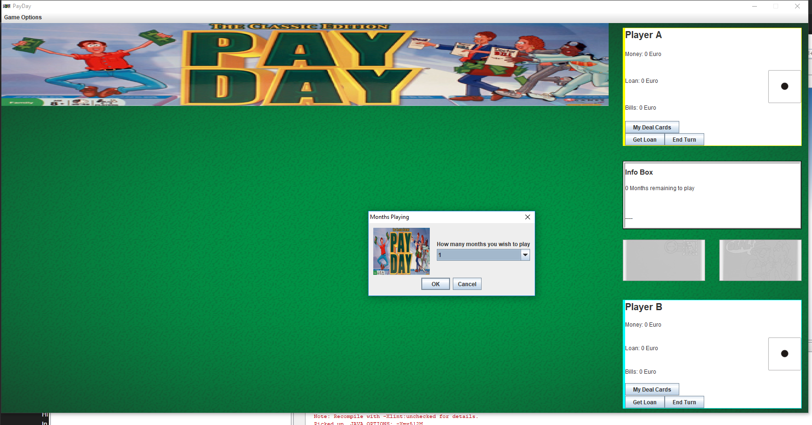
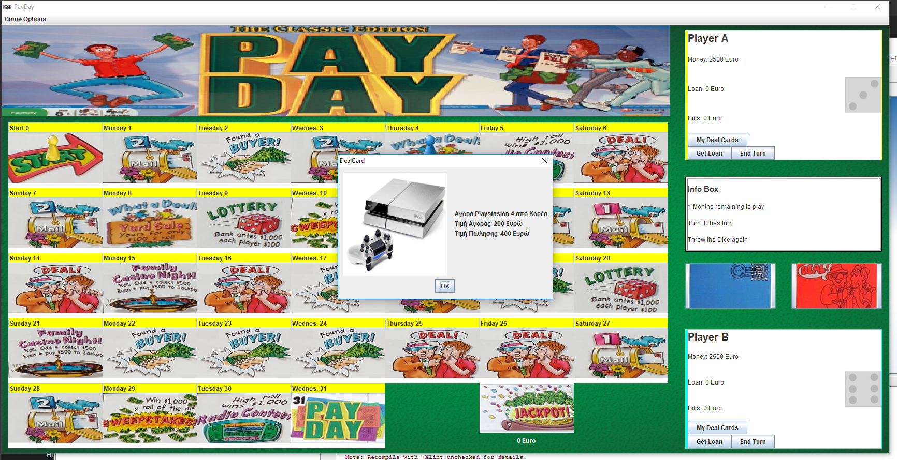

# Pay day

This is a project about Payday board game implemented with Java for a University course Project.

## Getting Started

Built and developed in Netbeans IDE.

### How to run

Open Netbeans and open project from payday folder. Hit Run

### Screenshots of the game

